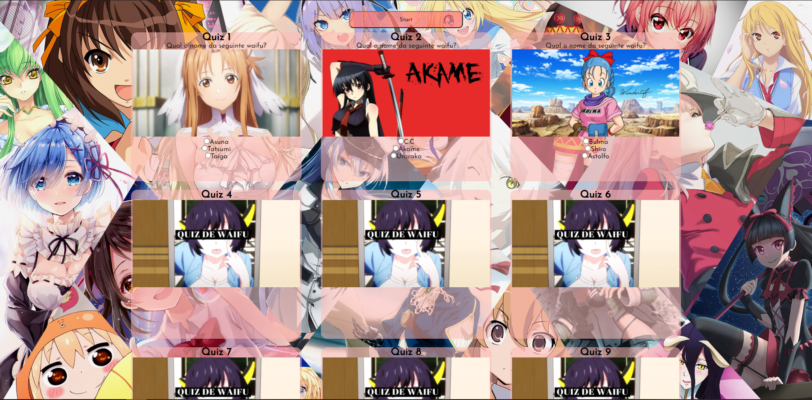

# Trabalho de LIMA - Jogo de quiz
Neste trabalho eu utilizei cards em cada quiz, no seu HTML.

No CSS utilizei tags para fazer um "Flip" das cards.

No JS utilizei JSON para criar o deck de perguntas e respostas, junto com todas as funções para o funcionamento do jogo e local storage.
___
Me baseei no seguinte wireframe

---
O intuito do trabalho era construir um site com um jogo de perguntas e respostas utilizando-se de cards.
